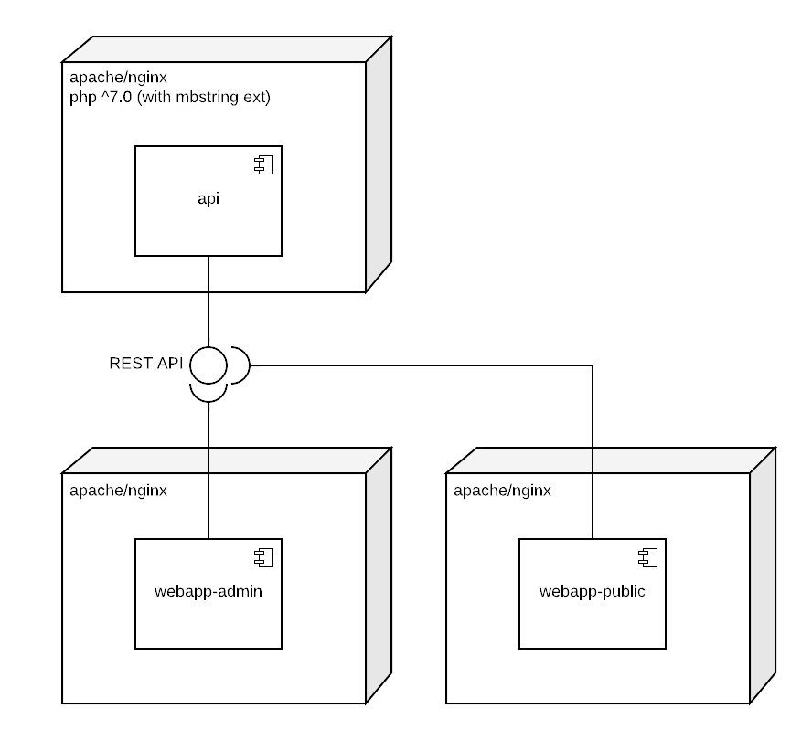

# find-your-service

Find Your Service is an application that allow consumers to search for services. It was made as a test project for a job interview. The full specification is available [here](docs/FindYourService.com%20-%20Full%202019.pdf).

You can find running instances on:

* API: https://find-your-service.herokuapp.com
* Admin site: https://find-your-service.herokuapp.com/admin 
* Public site: https://find-your-service.herokuapp.com/public

To log into the Admin site you should use the following credentials: (admin@findyourservice.io, password)

API docs are available here: https://documenter.getpostman.com/view/1952436/RznHKHk5

## Development

### Architecture

### Code Quality

We use the following coding style standards:

Source compliance is checked automatically by Travis after every push. It uses `phpcs` and `standard` for `php` and `js` sources respectively.

## Deployment

### Heroku

### Docker

<!-- TODO -->

## License

The MIT License

Copyright (c) 2019 Agustín Rodríguez

Permission is hereby granted, free of charge, to any person obtaining a copy
of this software and associated documentation files (the "Software"), to deal
in the Software without restriction, including without limitation the rights
to use, copy, modify, merge, publish, distribute, sublicense, and/or sell
copies of the Software, and to permit persons to whom the Software is
furnished to do so, subject to the following conditions:

The above copyright notice and this permission notice shall be included in
all copies or substantial portions of the Software.

THE SOFTWARE IS PROVIDED "AS IS", WITHOUT WARRANTY OF ANY KIND, EXPRESS OR
IMPLIED, INCLUDING BUT NOT LIMITED TO THE WARRANTIES OF MERCHANTABILITY,
FITNESS FOR A PARTICULAR PURPOSE AND NONINFRINGEMENT. IN NO EVENT SHALL THE
AUTHORS OR COPYRIGHT HOLDERS BE LIABLE FOR ANY CLAIM, DAMAGES OR OTHER
LIABILITY, WHETHER IN AN ACTION OF CONTRACT, TORT OR OTHERWISE, ARISING FROM,
OUT OF OR IN CONNECTION WITH THE SOFTWARE OR THE USE OR OTHER DEALINGS IN
THE SOFTWARE.
